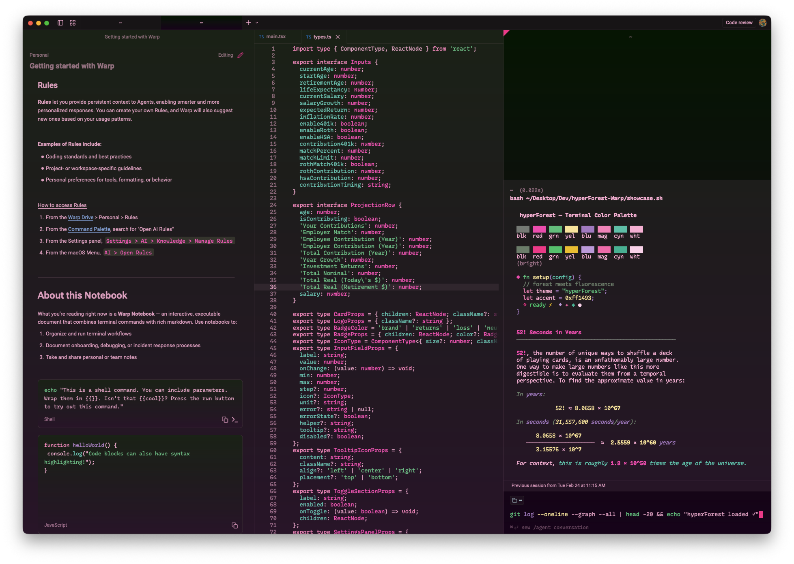

# hyperForest for Warp

Dark terminal themes with deep forest greens and fluorescent pinks. Part of the [hyperForest](https://github.com/mygirleatsmayo?tab=repositories&q=hyperForest) theme family.

## Themes

### hyperForest
Solid dark green background with the core hyperForest palette.


### hyperForestBloodBloom
Variant with a subtle green-to-purple background gradient.



Both themes share the same ANSI color palette.

## Install

1. Copy the `.yaml` files to your Warp themes directory:
   ```bash
   cp *.yaml ~/.warp/themes/
   ```
2. Open Warp → **Settings → Appearance → Themes** and select **hyperForest** or **hyperForestBloodBloom**.

## Palette

| Color | Hex | Role |
|-------|-----|------|
| Deep Pink | `#ff1493` | Accent, cursor, bright red |
| Bright Pink | `#ff3db8` | Normal red |
| Hot Pink | `#ff69b4` | Bright magenta |
| Soft Pink | `#ff85c1` | Normal magenta |
| Light Pink | `#ffb3d9` | Foreground, normal white |
| Very Light Pink | `#ffd4ec` | Bright white |
| Mint | `#4fc882` | Normal green |
| Green | `#2ecc71` | Bright green |
| Pale Yellow | `#f9e79f` | Normal yellow |
| Yellow | `#f1c40f` | Bright yellow |
| Soft Purple | `#B080C8` | Normal blue |
| Lavender | `#C9A0E0` | Bright blue |
| Bright Teal | `#48c9b0` | Normal cyan |
| Teal | `#1abc9c` | Bright cyan |
| Grey-Green | `#7F857F` | Normal black |
| Sage | `#738873` | Bright black |
| Deep Forest | `#001700` | Background (both) |
| Dark Purple | `#19001B` | Background bottom (BloodBloom) |
